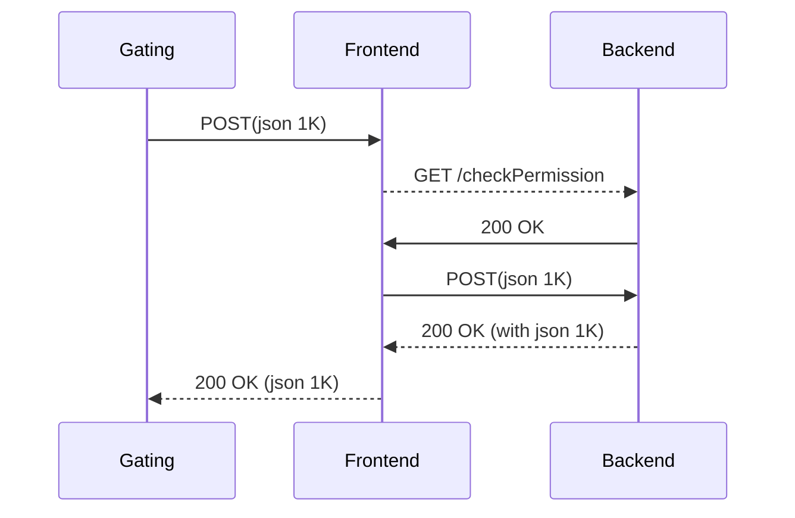

# reactor-netty-httpclient-benchmarks

Various benchmarks for Reactor Netty Http Client

## Prerequisites:
First build the following projects and publish them into your local M2:

```
git checkout -b workstealing-pool git@github.com:pderop/reactor-pool.git
cd reactor-pool
./gradlew publishToMavenLocal

git checkout -b workstealing-pool git@github.com:pderop/reactor-netty.git
cd reactor-netty
./gradlew publishToMavenLocal
```

## Build

build the project with jdk21 (the gradle wrapper is not installed, you need to set it up using `gradle wrapper`)

## benchmarks descriptions

The samples are made up of three jars (ideally to be installed on three different machines):

- gatling/build/libs/gatling-1.0.0-all.jar
- frontend/build/libs/frontend-1.0.0.jar
- backend/build/libs/backend-1.0.0.jar

Gatling -> frontend -> backend

In Gatling, there are three scenarios: "Get", "Post", and "Post2"
- Get: a small HTTP/2 GET request is sent to the frontend, which forwards it to the backend
- Post: same as above, but with POST with a 1k json payload in both request and response
- Post2: a more complex scenario (the json payload is parsed by the frontend):



In addition to Gatling, there is a also a loader based on reactor netty HttpClient, with two supported scenarios: "get" and "post".

The benchmarks can be run in three mode:

- normal mode: The frontend uses the Reactor Netty Http2 client in order to forward requests to the backend
- non-colocated mode: the frontend http2 client is configured with a custom Event Loop Group with colocation disabled, like this:
```
    client = client.runOn(LoopResources.create("client-loops", 1, Runtime.getRuntime().availableProcessors(), true, false));
```
- work stealing mode: the frontend Http2Client uses an experimental (work in progress) work stealing reactor pool, where streams acquisition 
are handled by concurrent pools, each one being executed within its own event loop executor.
(there is one actual Http2Pool dedicated to each HttpClient event loop). 

## Start the servers

- start the backend (it will listen on 8080 port by default):
```
java -Dbackend.port=8080 -jar backend/build/libs/backend-1.0.0.jar
```

- start a frontend server in normal mode on port 8090
```
java -Dfrontend.port=8090 -Dbackend.host=BACKEND_IP -jar frontend/build/libs/frontend-1.0.0.jar
```

- start a frontend server in non-colocated mode on port 8091
```
java -Dfrontend.port=8091 -Dnocoloc=true -Dbackend.host=BACKEND_IP -jar frontend/build/libs/frontend-1.0.0.jar
```

- start a frontend server in work stealing mode mode on port 8092
```
java -Dfrontend.port=8092 -Dsteal=true -Dbackend.host=BACKEND_IP -jar frontend/build/libs/frontend-1.0.0.jar
```

## Start Gatling

- to bench whatever frontend, use the -Dfrontend.port parameter to select the right frontend port to test:
set FRONTEND_HOST and FRONTEND_PORT to either 8090, 8091, or 8092:
```
java -Dsteps=10 -Dfrontend.host=FRONTEND_HOST -Dfrontend.port=FRONTEND_PORT-jar gatling/build/libs/gatling-1.0.0-all.jar test-report-name Get Post
```
`-Dsteps` is used to configure the number of connections to establish. Do not use too much connections, it's HTTP/2 ! 
For the **Post2** scenario, there is an issue, and you must not use more than 5 connections (reduce it if you see any failures):
```
java -Dsteps=5 -Dfrontend.host=FRONTEND_HOST -Dfrontend.port=FRONTEND_PORT -jar gatling/build/libs/gatling-1.0.0-all.jar test-report-name Post2
```

## Or start h2load

alternatively, instead of using gatling, you can use **h2load**. First, install it:

on linux:
```
sudo apt-get install nghttp2-client
```

on macos:
```
brew install nghttp2
```

now, run the scenario with the run-h2load.sh script (the current working directory must be the toplevel project (where this README is located):
```
Usage: ./scripts/run-h2load.sh <frontend ipaddr> <backend ipaddr> <frontend port> <frontend nocoloc port> <frontend workstealing port> <nb connections>
./scripts/run-h2load.sh FRONTEND_IP BACKEND_IP 8090 8091 8092 10
```
In the above example, the script will test the three frontends (on port 8090, 8091, 8092), and will use 10 http2 connections during tests, with max-concurrent-streams=100.

## Start the reactor netty HttpClient loader:

there is a standalone reactor http client netty in the frontend, just invoke it like this:

```
java -cp frontend/build/libs/frontend-1.0.0.jar -Dsteal=true|false -Dbackend.host=BACKEND_IP -Dduration=5 -Dscenario=get|post org.example.ClientApp
```
for the **-Dscenario** option, set it either to `get` or `post`
for the **-Dsteal** option, set it either to `false` or `true`

## notes: 

- for the Post2 scenario, the max connections must not be too high, else the test will fail with many exceptions
and the frontend is then disconnected from the backend. See below the #issue 1.
using **-Dsteps=5** seems fine, maybe you'll need to reduce it.

## known issues

##### issue 1
When Gatling opens too much connections, we can get the following exceptions when running the **Post2** scenario 
This can happen in all modes, whether work stealing mode is used or not. Maybe a bug in the scenario, I don't know for 
the moment.

in the backend:
<details>
  <summary>io.netty.handler.codec.http2.Http2Exception: Stream 774273 does not exist for inbound frame RST_STREAM, endOfStream = false</summary>
14:57:52.480 [reactor-http-nio-10] WARN  i.n.channel.DefaultChannelPipeline - An exceptionCaught() event was fired, and it reached at the tail of the pipeline. It usually means the last handler in the pipeline did not handle the exception.
io.netty.handler.codec.http2.Http2Exception: Stream 774273 does not exist for inbound frame RST_STREAM, endOfStream = false
	at io.netty.handler.codec.http2.Http2Exception.connectionError(Http2Exception.java:109)
	at io.netty.handler.codec.http2.DefaultHttp2ConnectionDecoder$FrameReadListener.verifyStreamMayHaveExisted(DefaultHttp2ConnectionDecoder.java:696)
	at io.netty.handler.codec.http2.DefaultHttp2ConnectionDecoder$FrameReadListener.onRstStreamRead(DefaultHttp2ConnectionDecoder.java:455)
	at io.netty.handler.codec.http2.DefaultHttp2FrameReader.readRstStreamFrame(DefaultHttp2FrameReader.java:509)
	at io.netty.handler.codec.http2.DefaultHttp2FrameReader.processPayloadState(DefaultHttp2FrameReader.java:259)
	at io.netty.handler.codec.http2.DefaultHttp2FrameReader.readFrame(DefaultHttp2FrameReader.java:159)
	at io.netty.handler.codec.http2.DefaultHttp2ConnectionDecoder.decodeFrame(DefaultHttp2ConnectionDecoder.java:188)
	at io.netty.handler.codec.http2.DecoratingHttp2ConnectionDecoder.decodeFrame(DecoratingHttp2ConnectionDecoder.java:63)
	at io.netty.handler.codec.http2.DecoratingHttp2ConnectionDecoder.decodeFrame(DecoratingHttp2ConnectionDecoder.java:63)
	at io.netty.handler.codec.http2.Http2ConnectionHandler$FrameDecoder.decode(Http2ConnectionHandler.java:393)
	at io.netty.handler.codec.http2.Http2ConnectionHandler.decode(Http2ConnectionHandler.java:453)
	at io.netty.handler.codec.ByteToMessageDecoder.decodeRemovalReentryProtection(ByteToMessageDecoder.java:529)
	at io.netty.handler.codec.ByteToMessageDecoder.callDecode(ByteToMessageDecoder.java:468)
	at io.netty.handler.codec.ByteToMessageDecoder.channelRead(ByteToMessageDecoder.java:290)
	at io.netty.channel.AbstractChannelHandlerContext.invokeChannelRead(AbstractChannelHandlerContext.java:444)
	at io.netty.channel.AbstractChannelHandlerContext.invokeChannelRead(AbstractChannelHandlerContext.java:420)
	at io.netty.channel.AbstractChannelHandlerContext.fireChannelRead(AbstractChannelHandlerContext.java:412)
	at reactor.netty.http.server.HttpServerConfig$H2ChannelMetricsHandler.channelRead(HttpServerConfig.java:811)
	at io.netty.channel.AbstractChannelHandlerContext.invokeChannelRead(AbstractChannelHandlerContext.java:442)
	at io.netty.channel.AbstractChannelHandlerContext.invokeChannelRead(AbstractChannelHandlerContext.java:420)
	at io.netty.channel.AbstractChannelHandlerContext.fireChannelRead(AbstractChannelHandlerContext.java:412)
	at io.netty.handler.ssl.SslHandler.unwrap(SslHandler.java:1475)
	at io.netty.handler.ssl.SslHandler.decodeJdkCompatible(SslHandler.java:1338)
	at io.netty.handler.ssl.SslHandler.decode(SslHandler.java:1387)
	at io.netty.handler.codec.ByteToMessageDecoder.decodeRemovalReentryProtection(ByteToMessageDecoder.java:529)
	at io.netty.handler.codec.ByteToMessageDecoder.callDecode(ByteToMessageDecoder.java:468)
	at io.netty.handler.codec.ByteToMessageDecoder.channelRead(ByteToMessageDecoder.java:290)
	at io.netty.channel.AbstractChannelHandlerContext.invokeChannelRead(AbstractChannelHandlerContext.java:444)
	at io.netty.channel.AbstractChannelHandlerContext.invokeChannelRead(AbstractChannelHandlerContext.java:420)
	at io.netty.channel.AbstractChannelHandlerContext.fireChannelRead(AbstractChannelHandlerContext.java:412)
	at io.netty.channel.DefaultChannelPipeline$HeadContext.channelRead(DefaultChannelPipeline.java:1410)
	at io.netty.channel.AbstractChannelHandlerContext.invokeChannelRead(AbstractChannelHandlerContext.java:440)
	at io.netty.channel.AbstractChannelHandlerContext.invokeChannelRead(AbstractChannelHandlerContext.java:420)
	at io.netty.channel.DefaultChannelPipeline.fireChannelRead(DefaultChannelPipeline.java:919)
	at io.netty.channel.nio.AbstractNioByteChannel$NioByteUnsafe.read(AbstractNioByteChannel.java:166)
	at io.netty.channel.nio.NioEventLoop.processSelectedKey(NioEventLoop.java:788)
	at io.netty.channel.nio.NioEventLoop.processSelectedKeysOptimized(NioEventLoop.java:724)
	at io.netty.channel.nio.NioEventLoop.processSelectedKeys(NioEventLoop.java:650)
	at io.netty.channel.nio.NioEventLoop.run(NioEventLoop.java:562)
	at io.netty.util.concurrent.SingleThreadEventExecutor$4.run(SingleThreadEventExecutor.java:997)
	at io.netty.util.internal.ThreadExecutorMap$2.run(ThreadExecutorMap.java:74)
	at io.netty.util.concurrent.FastThreadLocalRunnable.run(FastThreadLocalRunnable.java:30)
	at java.base/java.lang.Thread.run(Thread.java:1583)
</details>

and many exceptions like the following in the frontend:

<details>
  <summary>reactor.core.publisher.Operators - Error while discarding element from a Collection, continuing with next element</summary>
14:59:19.444 [reactor-http-nio-2] WARN  reactor.core.publisher.Operators - Error while discarding element from a Collection, continuing with next element
io.netty.util.IllegalReferenceCountException: refCnt: 0, decrement: 1
	at io.netty.util.internal.ReferenceCountUpdater.toLiveRealRefCnt(ReferenceCountUpdater.java:83)
	at io.netty.util.internal.ReferenceCountUpdater.release(ReferenceCountUpdater.java:148)
	at io.netty.buffer.AbstractReferenceCountedByteBuf.release(AbstractReferenceCountedByteBuf.java:101)
	at io.netty.buffer.AbstractDerivedByteBuf.release0(AbstractDerivedByteBuf.java:98)
	at io.netty.buffer.AbstractDerivedByteBuf.release(AbstractDerivedByteBuf.java:94)
	at reactor.core.publisher.Operators.lambda$discardLocalAdapter$0(Operators.java:389)
	at java.base/java.util.function.Consumer.lambda$andThen$0(Consumer.java:65)
	at reactor.core.publisher.Operators.onDiscardMultiple(Operators.java:570)
	at reactor.core.publisher.MonoCollectList$MonoCollectListSubscriber.onError(MonoCollectList.java:106)
	at reactor.core.publisher.FluxPeek$PeekSubscriber.onError(FluxPeek.java:222)
	at reactor.core.publisher.FluxMap$MapSubscriber.onError(FluxMap.java:134)
	at reactor.core.publisher.MonoFlatMapMany$FlatMapManyInner.onError(MonoFlatMapMany.java:255)
	at reactor.netty.channel.FluxReceive.onInboundError(FluxReceive.java:465)
	at reactor.netty.channel.ChannelOperations.onInboundError(ChannelOperations.java:515)
	at reactor.netty.http.client.HttpClientOperations.onInboundClose(HttpClientOperations.java:324)
	at reactor.netty.channel.ChannelOperationsHandler.channelInactive(ChannelOperationsHandler.java:73)
	at io.netty.channel.AbstractChannelHandlerContext.invokeChannelInactive(AbstractChannelHandlerContext.java:305)
	at io.netty.channel.AbstractChannelHandlerContext.invokeChannelInactive(AbstractChannelHandlerContext.java:281)
	at io.netty.channel.AbstractChannelHandlerContext.fireChannelInactive(AbstractChannelHandlerContext.java:274)
	at io.netty.channel.DefaultChannelPipeline$HeadContext.channelInactive(DefaultChannelPipeline.java:1405)
	at io.netty.channel.AbstractChannelHandlerContext.invokeChannelInactive(AbstractChannelHandlerContext.java:301)
	at io.netty.channel.AbstractChannelHandlerContext.invokeChannelInactive(AbstractChannelHandlerContext.java:281)
	at io.netty.channel.DefaultChannelPipeline.fireChannelInactive(DefaultChannelPipeline.java:901)
	at io.netty.handler.codec.http2.AbstractHttp2StreamChannel$Http2ChannelUnsafe$2.run(AbstractHttp2StreamChannel.java:791)
	at io.netty.util.concurrent.AbstractEventExecutor.runTask(AbstractEventExecutor.java:173)
	at io.netty.util.concurrent.AbstractEventExecutor.safeExecute(AbstractEventExecutor.java:166)
	at io.netty.util.concurrent.SingleThreadEventExecutor.runAllTasks(SingleThreadEventExecutor.java:470)
	at io.netty.channel.nio.NioEventLoop.run(NioEventLoop.java:566)
	at io.netty.util.concurrent.SingleThreadEventExecutor$4.run(SingleThreadEventExecutor.java:997)
	at io.netty.util.internal.ThreadExecutorMap$2.run(ThreadExecutorMap.java:74)
	at io.netty.util.concurrent.FastThreadLocalRunnable.run(FastThreadLocalRunnable.java:30)
	at java.base/java.lang.Thread.run(Thread.java:1583)
14:59:19.444 [reactor-http-nio-2] ERROR r.n.http.server.HttpServerOperations - [5a85beff/172421-1, L:/127.0.0.1:8090 - R:/127.0.0.1:58523] Error starting response. Replying error status
reactor.netty.http.client.PrematureCloseException: Connection prematurely closed DURING response

io.netty.channel.ChannelPipelineException: io.netty.handler.codec.http2.Http2FrameCodec.handlerRemoved() has thrown an exception.
at io.netty.channel.DefaultChannelPipeline.callHandlerRemoved0(DefaultChannelPipeline.java:640)
at io.netty.channel.DefaultChannelPipeline.destroyDown(DefaultChannelPipeline.java:876)
at io.netty.channel.DefaultChannelPipeline.destroyUp(DefaultChannelPipeline.java:844)
at io.netty.channel.DefaultChannelPipeline.destroy(DefaultChannelPipeline.java:836)
at io.netty.channel.DefaultChannelPipeline.access$700(DefaultChannelPipeline.java:46)
at io.netty.channel.DefaultChannelPipeline$HeadContext.channelUnregistered(DefaultChannelPipeline.java:1392)
at io.netty.channel.AbstractChannelHandlerContext.invokeChannelUnregistered(AbstractChannelHandlerContext.java:215)
at io.netty.channel.AbstractChannelHandlerContext.invokeChannelUnregistered(AbstractChannelHandlerContext.java:195)
at io.netty.channel.DefaultChannelPipeline.fireChannelUnregistered(DefaultChannelPipeline.java:821)
at io.netty.channel.AbstractChannel$AbstractUnsafe$7.run(AbstractChannel.java:821)
at io.netty.util.concurrent.AbstractEventExecutor.runTask(AbstractEventExecutor.java:173)
at io.netty.util.concurrent.AbstractEventExecutor.safeExecute(AbstractEventExecutor.java:166)
at io.netty.util.concurrent.SingleThreadEventExecutor.runAllTasks(SingleThreadEventExecutor.java:470)
at io.netty.channel.nio.NioEventLoop.run(NioEventLoop.java:566)
at io.netty.util.concurrent.SingleThreadEventExecutor$4.run(SingleThreadEventExecutor.java:997)
at io.netty.util.internal.ThreadExecutorMap$2.run(ThreadExecutorMap.java:74)
at io.netty.util.concurrent.FastThreadLocalRunnable.run(FastThreadLocalRunnable.java:30)
at java.base/java.lang.Thread.run(Thread.java:1583)
Caused by: io.netty.util.IllegalReferenceCountException: refCnt: 0, decrement: 1
at io.netty.util.internal.ReferenceCountUpdater.toLiveRealRefCnt(ReferenceCountUpdater.java:83)
at io.netty.util.internal.ReferenceCountUpdater.release(ReferenceCountUpdater.java:148)
at io.netty.buffer.AbstractReferenceCountedByteBuf.release(AbstractReferenceCountedByteBuf.java:101)
at io.netty.handler.codec.ByteToMessageDecoder.handlerRemoved(ByteToMessageDecoder.java:269)
at io.netty.channel.AbstractChannelHandlerContext.callHandlerRemoved(AbstractChannelHandlerContext.java:1122)
at io.netty.channel.DefaultChannelPipeline.callHandlerRemoved0(DefaultChannelPipeline.java:637)

</details>

Work Around: reduce number of http2 connections used by Gatling (use -Dsteps option which is used to configure the number of connections).

##### issue 2
With normal (no work steal mode), for the Gatling/Post test, we can observe this exception in the frontend:

<details>
  <summary>IllegalReferenceCountException: refCnt: 0, increment: 1</summary>
13:05:10.177 [reactor-http-epoll-3] WARN  r.n.http.client.HttpClientConnect - [726d00f4/154549-1, L:/10.128.15.214:35380 - R:10.128.15.218/10.128.15.218:8080] The connection observed an error
io.netty.util.IllegalReferenceCountException: refCnt: 0, increment: 1
        at io.netty.util.internal.ReferenceCountUpdater.retain0(ReferenceCountUpdater.java:133)
        at io.netty.util.internal.ReferenceCountUpdater.retain(ReferenceCountUpdater.java:120)
        at io.netty.buffer.AbstractReferenceCountedByteBuf.retain(AbstractReferenceCountedByteBuf.java:81)
        at io.netty.buffer.AbstractDerivedByteBuf.retain0(AbstractDerivedByteBuf.java:58)
        at io.netty.buffer.AbstractDerivedByteBuf.retain(AbstractDerivedByteBuf.java:54)
        at reactor.core.publisher.FluxPeek$PeekSubscriber.onNext(FluxPeek.java:185)
        at reactor.core.publisher.FluxMap$MapSubscriber.onNext(FluxMap.java:122)
        at reactor.netty.channel.FluxReceive.drainReceiver(FluxReceive.java:294)
        at reactor.netty.channel.FluxReceive.request(FluxReceive.java:133)
        at reactor.core.publisher.FluxMap$MapSubscriber.request(FluxMap.java:164)
        at reactor.core.publisher.FluxPeek$PeekSubscriber.request(FluxPeek.java:138)
        at reactor.core.publisher.Operators$BaseFluxToMonoOperator.request(Operators.java:2041)
        at reactor.core.publisher.FluxContextWrite$ContextWriteSubscriber.request(FluxContextWrite.java:136)
        at reactor.core.publisher.FluxHandleFuseable$HandleFuseableSubscriber.request(FluxHandleFuseable.java:260)
        at reactor.core.publisher.FluxDoFinally$DoFinallySubscriber.request(FluxDoFinally.java:140)
        at reactor.core.publisher.FluxMap$MapSubscriber.request(FluxMap.java:164)
        at reactor.core.publisher.FluxPeek$PeekSubscriber.request(FluxPeek.java:138)
        at reactor.core.publisher.FluxMap$MapSubscriber.request(FluxMap.java:164)
        at reactor.core.publisher.MonoFlatMap$FlatMapMain.request(MonoFlatMap.java:194)
        at reactor.core.publisher.FluxContextWrite$ContextWriteSubscriber.request(FluxContextWrite.java:136)
        at reactor.netty.channel.ChannelOperations.onSubscribe(ChannelOperations.java:273)
        at reactor.core.publisher.FluxContextWrite$ContextWriteSubscriber.onSubscribe(FluxContextWrite.java:101)
        at reactor.core.publisher.MonoFlatMap$FlatMapMain.onSubscribe(MonoFlatMap.java:117)
        at reactor.core.publisher.FluxMap$MapSubscriber.onSubscribe(FluxMap.java:92)
        at reactor.core.publisher.FluxPeek$PeekSubscriber.onSubscribe(FluxPeek.java:171)
        at reactor.core.publisher.FluxMap$MapSubscriber.onSubscribe(FluxMap.java:92)
        at reactor.core.publisher.FluxDoFinally$DoFinallySubscriber.onSubscribe(FluxDoFinally.java:107)
        at reactor.core.publisher.FluxHandleFuseable$HandleFuseableSubscriber.onSubscribe(FluxHandleFuseable.java:164)
        at reactor.core.publisher.FluxContextWrite$ContextWriteSubscriber.onSubscribe(FluxContextWrite.java:101)
        at reactor.core.publisher.Operators$BaseFluxToMonoOperator.onSubscribe(Operators.java:2025)
        at reactor.core.publisher.FluxPeek$PeekSubscriber.onSubscribe(FluxPeek.java:171)
        at reactor.core.publisher.FluxMap$MapSubscriber.onSubscribe(FluxMap.java:92)
        at reactor.netty.channel.FluxReceive.startReceiver(FluxReceive.java:172)
        at reactor.netty.channel.FluxReceive.lambda$subscribe$2(FluxReceive.java:150)
        at io.netty.util.concurrent.AbstractEventExecutor.runTask(AbstractEventExecutor.java:173)
        at io.netty.util.concurrent.AbstractEventExecutor.safeExecute(AbstractEventExecutor.java:166)
        at io.netty.util.concurrent.SingleThreadEventExecutor.runAllTasks(SingleT^C
        at reactor.core.publisher.FluxPeek$PeekSubscriber.onSubscribe(FluxPeek.java:171)
        at reactor.core.publisher.FluxMap$MapSubscriber.onSubscribe(FluxMap.java:92)
        at reactor.core.publisher.FluxDoFinally$DoFinallySubscriber.onSubscribe(FluxDoFinally.java:107)
        at reactor.core.publisher.FluxHandleFuseable$HandleFuseableSubscriber.onSubscribe(FluxHandleFuseable.java:164)
        at reactor.core.publisher.FluxContextWrite$ContextWriteSubscriber.onSubscribe(FluxContextWrite.java:101)
        at reactor.core.publisher.Operators$BaseFluxToMonoOperator.onSubscribe(Operators.java:2025)
        at reactor.core.publisher.FluxPeek$PeekSubscriber.onSubscribe(FluxPeek.java:171)
        at reactor.core.publisher.FluxMap$MapSubscriber.onSubscribe(FluxMap.java:92)
        at reactor.netty.channel.FluxReceive.startReceiver(FluxReceive.java:172)
        at reactor.netty.channel.FluxReceive.lambda$subscribe$2(FluxReceive.java:150)
        at io.netty.util.concurrent.AbstractEventExecutor.runTask(AbstractEventExecutor.java:173)
        at io.netty.util.concurrent.AbstractEventExecutor.safeExecute(AbstractEventExecutor.java:166)
        at io.netty.util.concurrent.SingleThreadEventExecutor.runAllTasks(SingleThreadEventExecutor.java:470)
        at io.netty.channel.epoll.EpollEventLoop.run(EpollEventLoop.java:413)
        at io.netty.util.concurrent.SingleThreadEventExecutor$4.run(SingleThreadEventExecutor.java:997)
        at io.netty.util.internal.ThreadExecutorMap$2.run(ThreadExecutorMap.java:74)
        at io.netty.util.concurrent.FastThreadLocalRunnable.run(FastThreadLocalRunnable.java:30)
        at java.base/java.lang.Thread.run(Thread.java:1583)
</details>

##### issue 3

with work steal mode, we can see this exception sometimes in the frontend:
<details>
  <summary>reactor.core.publisher.Operators - Error while discarding element from a Collection, continuing with next element</summary>
13:15:46.093 [reactor-http-epoll-11] WARN  reactor.core.publisher.Operators - Error while discarding element from a Collection, continuing with next element
io.netty.util.IllegalReferenceCountException: refCnt: 0, decrement: 1
        at io.netty.util.internal.ReferenceCountUpdater.toLiveRealRefCnt(ReferenceCountUpdater.java:83)
        at io.netty.util.internal.ReferenceCountUpdater.release(ReferenceCountUpdater.java:148)
        at io.netty.buffer.AbstractReferenceCountedByteBuf.release(AbstractReferenceCountedByteBuf.java:101)
        at io.netty.buffer.AbstractDerivedByteBuf.release0(AbstractDerivedByteBuf.java:98)
        at io.netty.buffer.AbstractDerivedByteBuf.release(AbstractDerivedByteBuf.java:94)
        at reactor.core.publisher.Operators.lambda$discardLocalAdapter$0(Operators.java:389)
        at java.base/java.util.function.Consumer.lambda$andThen$0(Consumer.java:65)
        at java.base/java.util.function.Consumer.lambda$andThen$0(Consumer.java:65)
        at reactor.core.publisher.Operators.onDiscardMultiple(Operators.java:570)
        at reactor.core.publisher.MonoCollectList$MonoCollectListSubscriber.onError(MonoCollectList.java:106)
        at reactor.core.publisher.FluxPeek$PeekSubscriber.onError(FluxPeek.java:222)
        at reactor.core.publisher.FluxMap$MapSubscriber.onError(FluxMap.java:134)
        at reactor.netty.channel.FluxReceive.onInboundError(FluxReceive.java:465)
        at reactor.netty.channel.ChannelOperations.onInboundError(ChannelOperations.java:515)
        at reactor.netty.http.server.HttpServerOperations.onInboundClose(HttpServerOperations.java:699)
        at reactor.netty.channel.ChannelOperationsHandler.channelInactive(ChannelOperationsHandler.java:73)
        at io.netty.channel.AbstractChannelHandlerContext.invokeChannelInactive(AbstractChannelHandlerContext.java:305)
        at io.netty.channel.AbstractChannelHandlerContext.invokeChannelInactive(AbstractChannelHandlerContext.java:281)
        at io.netty.channel.AbstractChannelHandlerContext.fireChannelInactive(AbstractChannelHandlerContext.java:274)
        at reactor.netty.http.server.AbstractHttpServerMetricsHandler.channelInactive(AbstractHttpServerMetricsHandler.java:126)
        at io.netty.channel.AbstractChannelHandlerContext.invokeChannelInactive(AbstractChannelHandlerContext.java:303)
        at io.netty.channel.AbstractChannelHandlerContext.invokeChannelInactive(AbstractChannelHandlerContext.java:281)
        at io.netty.channel.AbstractChannelHandlerContext.fireChannelInactive(AbstractChannelHandlerContext.java:274)
        at io.netty.channel.DefaultChannelPipeline$HeadContext.channelInactive(DefaultChannelPipeline.java:1405)
        at io.netty.channel.AbstractChannelHandlerContext.invokeChannelInactive(AbstractChannelHandlerContext.java:301)
        at io.netty.channel.AbstractChannelHandlerContext.invokeChannelInactive(AbstractChannelHandlerContext.java:281)
        at io.netty.channel.DefaultChannelPipeline.fireChannelInactive(DefaultChannelPipeline.java:901)
        at io.netty.handler.codec.http2.AbstractHttp2StreamChannel$Http2ChannelUnsafe$2.run(AbstractHttp2StreamChannel.java:791)
        at io.netty.util.concurrent.AbstractEventExecutor.runTask(AbstractEventExecutor.java:173)
        at io.netty.util.concurrent.AbstractEventExecutor.safeExecute(AbstractEventExecutor.java:166)
        at io.netty.util.concurrent.SingleThreadEventExecutor.runAllTasks(SingleThreadEventExecutor.java:470)
        at io.netty.channel.epoll.EpollEventLoop.run(EpollEventLoop.java:416)
        at io.netty.util.concurrent.SingleThreadEventExecutor$4.run(SingleThreadEventExecutor.java:997)
        at io.netty.util.internal.ThreadExecutorMap$2.run(ThreadExecutorMap.java:74)
        at io.netty.util.concurrent.FastThreadLocalRunnable.run(FastThreadLocalRunnable.java:30)
        at java.base/java.lang.Thread.run(Thread.java:1583)
</details>

##### issue 4

with work steal mode, for the Gatling/Post2 scenarion, we can see this exception in the frontend:
<details>
  <summary>io.netty.util.IllegalReferenceCountException: refCnt: 0, decrement: 1</summary>
io.netty.util.IllegalReferenceCountException: refCnt: 0, decrement: 1
        at io.netty.util.internal.ReferenceCountUpdater.toLiveRealRefCnt(ReferenceCountUpdater.java:83)
        at io.netty.util.internal.ReferenceCountUpdater.release(ReferenceCountUpdater.java:148)
        at io.netty.buffer.AbstractReferenceCountedByteBuf.release(AbstractReferenceCountedByteBuf.java:101)
        at io.netty.buffer.AbstractDerivedByteBuf.release0(AbstractDerivedByteBuf.java:98)
        at io.netty.buffer.AbstractDerivedByteBuf.release(AbstractDerivedByteBuf.java:94)
        at io.netty.util.ReferenceCountUtil.release(ReferenceCountUtil.java:90)
        at io.netty.util.ReferenceCountUtil.safeRelease(ReferenceCountUtil.java:116)
        at io.netty.buffer.CompositeByteBuf.addComponents(CompositeByteBuf.java:555)
        at io.netty.buffer.CompositeByteBuf.addComponents(CompositeByteBuf.java:251)
        at reactor.netty.ByteBufFlux.lambda$aggregate$7(ByteBufFlux.java:283)
        at reactor.core.publisher.FluxHandleFuseable$HandleFuseableSubscriber.onNext(FluxHandleFuseable.java:179)
        at reactor.core.publisher.FluxContextWrite$ContextWriteSubscriber.onNext(FluxContextWrite.java:107)
        at reactor.core.publisher.Operators$BaseFluxToMonoOperator.completePossiblyEmpty(Operators.java:2071)
        at reactor.core.publisher.MonoCollectList$MonoCollectListSubscriber.onComplete(MonoCollectList.java:118)
        at reactor.core.publisher.FluxPeek$PeekSubscriber.onComplete(FluxPeek.java:260)
        at reactor.core.publisher.FluxMap$MapSubscriber.onComplete(FluxMap.java:144)
        at reactor.core.publisher.MonoFlatMapMany$FlatMapManyInner.onComplete(MonoFlatMapMany.java:260)
        at reactor.netty.channel.FluxReceive.onInboundComplete(FluxReceive.java:415)
        at reactor.netty.channel.ChannelOperations.onInboundComplete(ChannelOperations.java:446)
        at reactor.netty.channel.ChannelOperations.terminate(ChannelOperations.java:500)
        at reactor.netty.http.client.HttpClientOperations.onInboundNext(HttpClientOperations.java:772)
        at reactor.netty.channel.ChannelOperationsHandler.channelRead(ChannelOperationsHandler.java:114)
        at io.netty.channel.AbstractChannelHandlerContext.invokeChannelRead(AbstractChannelHandlerContext.java:444)
        at io.netty.channel.AbstractChannelHandlerContext.invokeChannelRead(AbstractChannelHandlerContext.java:420)
        at io.netty.channel.AbstractChannelHandlerContext.fireChannelRead(AbstractChannelHandlerContext.java:412)
        at reactor.netty.http.client.AbstractHttpClientMetricsHandler.channelRead(AbstractHttpClientMetricsHandler.java:162)
        at io.netty.channel.AbstractChannelHandlerContext.invokeChannelRead(AbstractChannelHandlerContext.java:442)
        at io.netty.channel.AbstractChannelHandlerContext.invokeChannelRead(AbstractChannelHandlerContext.java:420)
        at io.netty.channel.AbstractChannelHandlerContext.fireChannelRead(AbstractChannelHandlerContext.java:412)
        at io.netty.handler.codec.MessageToMessageDecoder.channelRead(MessageToMessageDecoder.java:103)
        at io.netty.handler.codec.MessageToMessageCodec.channelRead(MessageToMessageCodec.java:111)
        at io.netty.channel.AbstractChannelHandlerContext.invokeChannelRead(AbstractChannelHandlerContext.java:442)
        at io.netty.channel.AbstractChannelHandlerContext.invokeChannelRead(AbstractChannelHandlerContext.java:420)
        at io.netty.channel.AbstractChannelHandlerContext.fireChannelRead(AbstractChannelHandlerContext.java:412)
        at io.netty.channel.DefaultChannelPipeline$HeadContext.channelRead(DefaultChannelPipeline.java:1410)
        at io.netty.channel.AbstractChannelHandlerContext.invokeChannelRead(AbstractChannelHandlerContext.java:440)
        at io.netty.channel.AbstractChannelHandlerContext.invokeChannelRead(AbstractChannelHandlerContext.java:420)
        at io.netty.channel.DefaultChannelPipeline.fireChannelRead(DefaultChannelPipeline.java:919)
        at io.netty.handler.codec.http2.AbstractHttp2StreamChannel$Http2ChannelUnsafe.doRead0(AbstractHttp2StreamChannel.java:955)
        at io.netty.handler.codec.http2.AbstractHttp2StreamChannel.fireChildRead(AbstractHttp2StreamChannel.java:600)
        at io.netty.handler.codec.http2.Http2MultiplexHandler.channelRead(Http2MultiplexHandler.java:195)
        at io.netty.channel.AbstractChannelHandlerContext.invokeChannelRead(AbstractChannelHandlerContext.java:442)
        at io.netty.channel.AbstractChannelHandlerContext.invokeChannelRead(AbstractChannelHandlerContext.java:420)
        at io.netty.channel.AbstractChannelHandlerContext.fireChannelRead(AbstractChannelHandlerContext.java:412)
        at io.netty.handler.codec.http2.Http2FrameCodec.onHttp2Frame(Http2FrameCodec.java:712)
        at io.netty.handler.codec.http2.Http2FrameCodec$FrameListener.onDataRead(Http2FrameCodec.java:651)
        at io.netty.handler.codec.http2.Http2FrameListenerDecorator.onDataRead(Http2FrameListenerDecorator.java:36)
        at io.netty.handler.codec.http2.Http2EmptyDataFrameListener.onDataRead(Http2EmptyDataFrameListener.java:49)
        at io.netty.handler.codec.http2.DefaultHttp2ConnectionDecoder$FrameReadListener.onDataRead(DefaultHttp2ConnectionDecoder.java:322)
        at io.netty.handler.codec.http2.DefaultHttp2FrameReader.readDataFrame(DefaultHttp2FrameReader.java:415)
        at io.netty.handler.codec.http2.DefaultHttp2FrameReader.processPayloadState(DefaultHttp2FrameReader.java:250)
        at io.netty.handler.codec.http2.DefaultHttp2FrameReader.readFrame(DefaultHttp2FrameReader.java:159)
        at io.netty.handler.codec.http2.DefaultHttp2ConnectionDecoder.decodeFrame(DefaultHttp2ConnectionDecoder.java:188)
        at io.netty.handler.codec.http2.DecoratingHttp2ConnectionDecoder.decodeFrame(DecoratingHttp2ConnectionDecoder.java:63)
        at io.netty.handler.codec.http2.Http2ConnectionHandler$FrameDecoder.decode(Http2ConnectionHandler.java:393)
        at io.netty.handler.codec.http2.Http2ConnectionHandler.decode(Http2ConnectionHandler.java:453)
        at io.netty.handler.codec.ByteToMessageDecoder.decodeRemovalReentryProtection(ByteToMessageDecoder.java:529)
        at io.netty.handler.codec.ByteToMessageDecoder.callDecode(ByteToMessageDecoder.java:468)
        at io.netty.handler.codec.ByteToMessageDecoder.channelRead(ByteToMessageDecoder.java:290)
        at io.netty.channel.AbstractChannelHandlerContext.invokeChannelRead(AbstractChannelHandlerContext.java:444)
        at io.netty.channel.AbstractChannelHandlerContext.invokeChannelRead(AbstractChannelHandlerContext.java:420)
        at io.netty.channel.AbstractChannelHandlerContext.fireChannelRead(AbstractChannelHandlerContext.java:412)
        at io.netty.handler.flush.FlushConsolidationHandler.channelRead(FlushConsolidationHandler.java:152)
        at io.netty.channel.AbstractChannelHandlerContext.invokeChannelRead(AbstractChannelHandlerContext.java:442)
        at io.netty.channel.AbstractChannelHandlerContext.invokeChannelRead(AbstractChannelHandlerContext.java:420)
        at io.netty.channel.AbstractChannelHandlerContext.fireChannelRead(AbstractChannelHandlerContext.java:412)
        at reactor.netty.channel.AbstractChannelMetricsHandler.channelRead(AbstractChannelMetricsHandler.java:132)
        at io.netty.channel.AbstractChannelHandlerContext.invokeChannelRead(AbstractChannelHandlerContext.java:442)
        at io.netty.channel.AbstractChannelHandlerContext.invokeChannelRead(AbstractChannelHandlerContext.java:420)
        at io.netty.channel.AbstractChannelHandlerContext.fireChannelRead(AbstractChannelHandlerContext.java:412)
        at io.netty.handler.ssl.SslHandler.unwrap(SslHandler.java:1475)
        at io.netty.handler.ssl.SslHandler.decodeJdkCompatible(SslHandler.java:1338)
        at io.netty.handler.ssl.SslHandler.decode(SslHandler.java:1387)
        at io.netty.handler.codec.ByteToMessageDecoder.decodeRemovalReentryProtection(ByteToMessageDecoder.java:529)
        at io.netty.handler.codec.ByteToMessageDecoder.callDecode(ByteToMessageDecoder.java:468)
        at io.netty.handler.codec.ByteToMessageDecoder.channelRead(ByteToMessageDecoder.java:290)
        at io.netty.channel.AbstractChannelHandlerContext.invokeChannelRead(AbstractChannelHandlerContext.java:444)
        at io.netty.channel.AbstractChannelHandlerContext.invokeChannelRead(AbstractChannelHandlerContext.java:420)
        at io.netty.channel.AbstractChannelHandlerContext.fireChannelRead(AbstractChannelHandlerContext.java:412)
        at io.netty.channel.DefaultChannelPipeline$HeadContext.channelRead(DefaultChannelPipeline.java:1410)
        at io.netty.channel.AbstractChannelHandlerContext.invokeChannelRead(AbstractChannelHandlerContext.java:440)
        at io.netty.channel.AbstractChannelHandlerContext.invokeChannelRead(AbstractChannelHandlerContext.java:420)
        at io.netty.channel.DefaultChannelPipeline.fireChannelRead(DefaultChannelPipeline.java:919)
        at io.netty.channel.epoll.AbstractEpollStreamChannel$EpollStreamUnsafe.epollInReady(AbstractEpollStreamChannel.java:800)
        at io.netty.channel.epoll.AbstractEpollChannel$AbstractEpollUnsafe$1.run(AbstractEpollChannel.java:425)
        at io.netty.util.concurrent.AbstractEventExecutor.runTask(AbstractEventExecutor.java:173)
        at io.netty.util.concurrent.AbstractEventExecutor.safeExecute(AbstractEventExecutor.java:166)
        at io.netty.util.concurrent.SingleThreadEventExecutor.runAllTasks(SingleThreadEventExecutor.java:470)
        at io.netty.channel.epoll.EpollEventLoop.run(EpollEventLoop.java:413)
        at io.netty.util.concurrent.SingleThreadEventExecutor$4.run(SingleThreadEventExecutor.java:997)
        at io.netty.util.internal.ThreadExecutorMap$2.run(ThreadExecutorMap.java:74)
        at io.netty.util.concurrent.FastThreadLocalRunnable.run(FastThreadLocalRunnable.java:30)
        at java.base/java.lang.Thread.run(Thread.java:1583)
</details>
